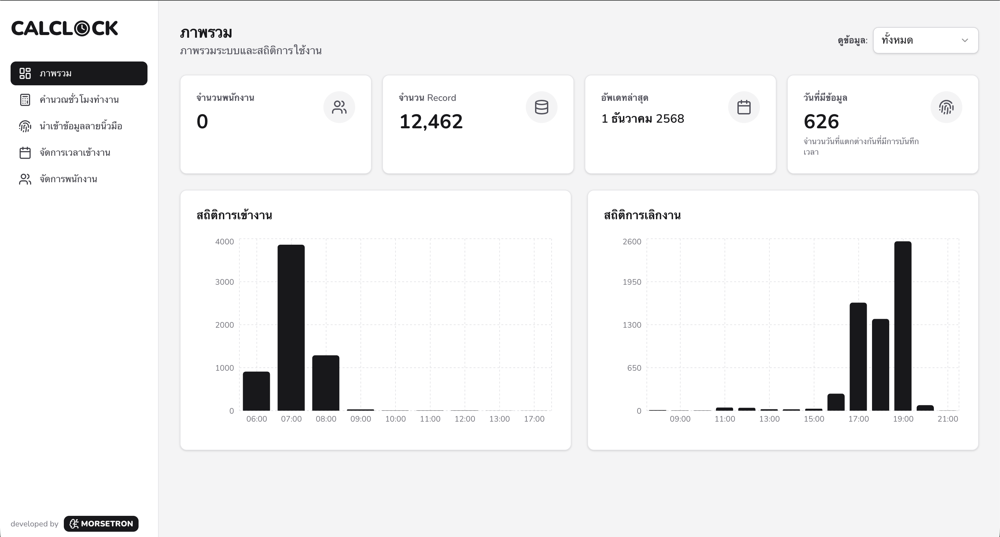

# Calclock App



ระบบคำนวณเวลาเข้างานและเงินเดือนสำหรับองค์กร ที่ช่วยจัดการข้อมูลพนักงาน บันทึกเวลาเข้า-ออกงาน คำนวณชั่วโมงทำงาน OT และสร้างรายงานเงินเดือนอัตโนมัติ

## Features

### 1. Employee Management

- เพิ่ม แก้ไข ลบข้อมูลพนักงาน
- บันทึกข้อมูล: ชื่อ, รหัส Fingerprint, เงินเดือนฐาน, ที่อยู่, เบอร์โทร, วันเกิด, เลขบัตรประชาชน
- กำหนดการมีประกันสังคม
- ค้นหาและแสดงผลแบบ Pagination

### 2. Time Recording

- อัปโหลดไฟล์เวลาเข้างานจากเครื่องสแกนลายนิ้วมือ
- รองรับไฟล์: `.txt`, `.csv`, `.xlsx`
- บันทึกข้อมูล: รหัส Fingerprint, วันที่, เวลา
- แสดงรายการเวลาเข้างานพร้อมชื่อพนักงาน
- เพิ่มเวลาเข้างานด้วยตนเอง (Manual Entry)

### 3. Shift Management

- กำหนดเวลาเข้า-ออกงานแต่ละวัน
- ปฏิทินแบบ Calendar View พร้อม Badge แสดงสถานะ
- กำหนดวันหยุดนักขัตฤกษ์
- เปิด/ปิดการคำนวณ OT ในแต่ละวัน
- แก้ไขข้อมูลกะเป็นรายวันผ่าน Dialog

### 4. Payroll Calculation

- เลือกช่วงวันที่สำหรับคำนวณ
- คำนวณวันทำงาน (Work Days)
- คำนวณ OT หลายประเภท:
  - **OT ปกติ**: ชั่วโมงทำงานเกิน 8 ชั่วโมง/วัน
  - **OT พักเที่ยง**: 0.5 ชั่วโมง (ถ้าทำงาน ≥ 8 ชั่วโมง)
  - **OT วันที่ 7**: ทำงานติดต่อกัน 7 วัน (วันที่ 7, 14, 21, ...)
  - **OT จากเปิดล่วงเวลา**: เปิดโหมด OT ในกะเฉพาะวัน
  - **OT วันหยุดนักขัตฤกษ์**: ทำงานในวันหยุด
- คำนวณเงินเดือนรวม OT ทุกประเภท
- Export ข้อมูลเป็น Excel (`.xlsx`)

### 5. Dashboard

- สถิติจำนวนพนักงาน
- สถิติบันทึกเวลาเข้างานทั้งหมด
- สถิติวันที่มีการบันทึกเวลา
- กราฟแสดงแนวโน้มการบันทึกเวลา
- กราฟแสดงพนักงานที่บันทึกเวลาบ่อยสุด
- กรองข้อมูลตามปี (พ.ศ.)

## Tech Stack

### Frontend

- **Next.js 16.0.6** - App Router, React Server Components
- **React 19.2.0** - UI Library
- **TypeScript 5** - Type Safety
- **TailwindCSS 4** - Styling
- **Shadcn UI** - Component Library

### Backend & Database

- **better-sqlite3** - SQLite Database (WAL mode)
- **Server Actions** - Data Mutations
- **sql.js** - SQLite in Browser (WASM) สำหรับ offline mode
- **IndexedDB** - Client-side storage สำหรับ offline data

### Libraries

- **FullCalendar** - Calendar View
- **Recharts** - Data Visualization
- **date-fns** - Date Utilities
- **Zod 4.1.13** - Schema Validation
- **PapaParse** - CSV Parser
- **XLSX** - Excel Import/Export
- **Zustand** - State Management
- **Lucide React** - Icon Library
- **React Day Picker** - Date Picker Component
- **@ducanh2912/next-pwa** - PWA Support

## Installation

### Prerequisites

- Node.js 20+
- pnpm (แนะนำ) หรือ npm/yarn

### Setup

1. Clone repository

```bash
git clone <repository-url>
cd calclock-app
```

2. ติดตั้ง dependencies

```bash
pnpm install
```

3. รันโปรเจค

```bash
pnpm dev
```

4. เปิดเบราว์เซอร์ไปที่ `http://localhost:3000`

## Database Schema

โปรเจคใช้ SQLite โดยไฟล์ฐานข้อมูลจะถูกสร้างอัตโนมัติที่ `calclock.db`

### Table: employees

- `id`: Primary Key
- `fingerprint`: รหัสลายนิ้วมือ (UNIQUE)
- `name`: ชื่อพนักงาน
- `base_salary`: เงินเดือนฐาน
- `address`: ที่อยู่
- `phone`: เบอร์โทรศัพท์
- `has_social_security`: มีประกันสังคม (0/1)
- `birthday`: วันเกิด
- `national_id`: เลขบัตรประชาชน
- `created_at`, `updated_at`: Timestamps

### Table: fingerprints

- `id`: Primary Key
- `fingerprint`: รหัสลายนิ้วมือ
- `date`: วันที่ (YYYY-MM-DD)
- `time`: เวลา (HH:MM:SS)
- `is_manual`: บันทึกด้วยตนเอง (0/1)
- `created_at`: Timestamp
- UNIQUE(fingerprint, date, time)

### Table: shifts

- `id`: Primary Key
- `date`: วันที่ (YYYY-MM-DD, UNIQUE)
- `check_in`: เวลาเข้างาน (HH:MM:SS)
- `check_out`: เวลาออกงาน (HH:MM:SS)
- `is_holiday`: วันหยุด (0/1)
- `enable_overtime`: เปิด OT (0/1)
- `created_at`, `updated_at`: Timestamps

## User Guide

### 1. Adding Employees

1. ไปที่หน้า **จัดการพนักงาน**
2. คลิก **"+ เพิ่มพนักงาน"**
3. กรอกข้อมูล:
   - รหัส Fingerprint (จำเป็น)
   - ชื่อ-นามสกุล (จำเป็น)
   - เงินเดือนฐาน (จำเป็น)
   - ข้อมูลอื่นๆ (ไม่บังคับ)
4. คลิก **"บันทึก"**

### 2. Uploading Time Records

#### รูปแบบไฟล์ที่รองรับ

**TXT/CSV Format:**

```
รหัส,วันที่,เวลา
001,2024-12-01,08:30:00
001,2024-12-01,17:45:00
002,2024-12-01,09:00:00
```

**Excel Format:**
| รหัส | วันที่ | เวลา |
|------|-------------|----------|
| 001 | 2024-12-01 | 08:30:00 |
| 001 | 2024-12-01 | 17:45:00 |

1. ไปที่หน้า **บันทึกเวลาเข้างาน**
2. คลิก **"เลือกไฟล์"**
3. เลือกไฟล์ `.txt`, `.csv` หรือ `.xlsx`
4. คลิก **"อัปโหลด"**
5. ระบบจะแสดงสถิติการอัปโหลด (เพิ่ม/ข้าม)

### 3. Managing Shifts

1. ไปที่หน้า **กำหนดกะเวลา**
2. คลิกที่วันในปฏิทิน
3. กำหนด:
   - เวลาเข้างาน (เช่น 08:00)
   - เวลาออกงาน (เช่น 17:00)
   - เปิด OT (ถ้าต้องการ)
   - วันหยุด (ถ้าเป็นวันหยุดนักขัตฤกษ์)
4. คลิก **"บันทึก"**

### 4. Calculating Payroll

1. ไปที่หน้า **คำนวณเวลาเข้างาน**
2. เลือกช่วงวันที่ (เช่น 1-31 ธ.ค. 2024)
3. คลิก **"คำนวณเวลาเข้างาน"**
4. ตรวจสอบผลลัพธ์:
   - วันทำงาน (Work Days)
   - OT แต่ละประเภท
   - เงินเดือนรวม
5. คลิก **"Export Excel"** เพื่อดาวน์โหลดรายงาน

### 5. Viewing Dashboard

1. ไปที่หน้า **หน้าหลัก**
2. เลือกปี (พ.ศ.) จาก dropdown (หรือดูทั้งหมด)
3. ดูสถิติและกราฟต่างๆ

## OT Calculation Rules

### 1. Regular OT

- ทำงานเกิน 8 ชั่วโมง/วัน
- **ตัวอย่าง:** ทำงาน 9 ชั่วโมง → OT 1 ชั่วโมง

### 2. Lunch Break OT

- ทำงาน ≥ 8 ชั่วโมง → OT พักเที่ยง 0.5 ชั่วโมง
- แสดงแยกต่างหาก ไม่รวมใน OT ปกติ

### 3. Day 7 OT

- ทำงานติดต่อกัน 7 วัน → วันที่ 7, 14, 21, ... นับเป็น OT ทั้งหมด
- Badge สีเขียว ในตาราง
- **ตัวอย่าง:**
  - วันที่ 1-6: นับเป็นวันทำงานปกติ
  - วันที่ 7: ทั้งวันนับเป็น OT

### 4. Overtime Mode OT

- กำหนด "เปิด OT" ในกะเฉพาะวัน
- Badge สีน้ำเงิน ในตาราง
- ชั่วโมงที่ทำเกินกะปกติจะนับเป็น OT

### 5. Holiday OT

- ทำงานในวันที่กำหนดเป็น "วันหยุด"
- Badge สีเหลือง ในตาราง
- ทั้งวันนับเป็น OT

### Late Arrival Rules

- **สาย ≤ 10 นาที:** ไม่หัก, ใช้เวลากะปกติ
- **สาย 11-30 นาที:** ปัดขึ้น 30 นาที (แสดงสัญลักษณ์เตือน สีแดง)
- **สาย > 30 นาที:** ปัดขึ้นชั่วโมงถัดไป (แสดงสัญลักษณ์สาย สีแดง)

### Lunch Break Deduction

- ทำงาน ≥ 8 ชั่วโมง: หักพักเที่ยง 1 ชั่วโมง อัตโนมัติ
- ทำงาน < 8 ชั่วโมง: ไม่หักพักเที่ยง

## Project Structure

```
calclock-app/
├── app/
│   ├── (app)/                      # App Routes
│   │   ├── dashboard/              # หน้า Dashboard
│   │   │   ├── page.tsx
│   │   │   └── actions.ts
│   │   ├── employee/               # หน้าจัดการพนักงาน
│   │   │   ├── page.tsx
│   │   │   └── actions.ts
│   │   ├── insert/                 # หน้าบันทึกเวลาเข้างาน
│   │   │   ├── page.tsx
│   │   │   └── actions.ts
│   │   ├── payroll/                # หน้าคำนวณเงินเดือน
│   │   │   ├── page.tsx
│   │   │   └── actions.ts
│   │   ├── shift/                  # หน้ากำหนดกะเวลา
│   │   │   ├── page.tsx
│   │   │   └── actions.ts
│   │   └── layout.tsx              # Layout พร้อม Navigation
│   ├── layout.tsx                  # Root Layout
│   ├── page.tsx                    # Landing Page
│   └── globals.css                 # Global Styles
├── components/
│   ├── ui/                         # Shadcn UI Components
│   ├── app-shell.tsx               # Navigation Shell
│   ├── dashboard-*.tsx             # Dashboard Components
│   ├── employee-*.tsx              # Employee Components
│   ├── fingerprint-table.tsx       # Fingerprint Table
│   ├── insert-form.tsx             # Upload Form
│   ├── payroll-*.tsx               # Payroll Components
│   └── shift-dialog.tsx            # Shift Dialog
├── lib/
│   ├── db.ts                       # Database Functions
│   ├── db-utils.ts                 # Database Utilities
│   ├── utils.ts                    # General Utilities
│   └── utils/
│       ├── format-thai-date.ts     # Thai Date Formatter
│       └── payroll-calculator.ts   # Payroll Calculation Logic
├── public/                         # Static Assets
│   └── template-timestamp.txt      # Upload Template
├── calclock.db                     # SQLite Database (WAL mode)
├── calclock.db-wal                 # SQLite WAL file
├── calclock.db-shm                 # SQLite Shared Memory file
├── package.json                    # Dependencies
├── pnpm-lock.yaml                  # pnpm Lock file
├── pnpm-workspace.yaml             # pnpm Workspace Config
├── tsconfig.json                   # TypeScript Config
├── postcss.config.mjs              # PostCSS Config (TailwindCSS 4)
├── eslint.config.mjs               # ESLint Config
├── components.json                 # Shadcn UI Config
└── next.config.ts                  # Next.js Config
```

## Build for Production

```bash
# Build
pnpm build

# Start production server
pnpm start
```

## 📱 PWA (Progressive Web App) - Desktop App

CalClock รองรับการติดตั้งเป็น Desktop Application (PWA) พร้อม offline capabilities

### ติดตั้ง PWA

1. **Build และ Start Server**
   ```bash
   pnpm build
   pnpm start
   ```

2. **ติดตั้งผ่าน Browser**
   - เปิด Chrome/Edge ไปที่ `http://localhost:3000`
   - คลิกปุ่ม **ติดตั้ง** (Install icon) ที่ address bar
   - App จะถูกติดตั้งเป็น desktop application

3. **หลังติดตั้ง**
   - ✅ App จะทำงาน standalone (ไม่ต้องเปิด browser)
   - ✅ Offline Database - ใช้งานได้โดยไม่ต้องมี server (ข้อมูลเก็บใน IndexedDB)
   - ✅ Auto Sync - sync ข้อมูลเมื่อกลับมา online อัตโนมัติ
   - ⚠️ API Calls - ยังต้องการ server รันอยู่

### การทำงาน Offline

- ข้อมูลทั้งหมดถูกเก็บใน **IndexedDB** ผ่าน sql.js
- สามารถ **เพิ่ม/แก้ไข/ลบ** ข้อมูลได้ปกติเมื่อ offline
- การเปลี่ยนแปลงจะถูกเก็บใน **Sync Queue**
- เมื่อกลับมา online จะ **sync อัตโนมัติ** ภายใน 30 วินาที

📖 **ดูรายละเอียดเพิ่มเติม:** [PWA_SETUP.md](./PWA_SETUP.md)

## Available Scripts

```bash
pnpm dev        # รัน development server
pnpm build      # Build สำหรับ production
pnpm start      # รัน production server
pnpm lint       # รัน ESLint
```

## UI/UX Features

- **Responsive Design**: รองรับทุกขนาดหน้าจอ
- **Dark Mode Ready**: พร้อมรองรับ Dark Mode
- **Loading States**: แสดงสถานะการโหลดข้อมูล
- **Error Handling**: แจ้งเตือนข้อผิดพลาดที่เข้าใจง่าย
- **Pagination**: แบ่งหน้าข้อมูลเพื่อ Performance
- **Toast Notifications**: แจ้งเตือนการทำงานสำเร็จ/ล้มเหลว
- **Confirmation Dialogs**: ยืนยันก่อนลบข้อมูล
- **Calendar View**: แสดงกะการทำงานแบบปฏิทิน
- **Color Badges**: แยกประเภท OT ด้วยสี

## Security

- Server-side validation ด้วย Zod
- SQL injection protection (Prepared Statements)
- Input sanitization
- Type safety ด้วย TypeScript

## Performance

- React Server Components (RSC)
- Pagination สำหรับข้อมูลขนาดใหญ่
- SQLite WAL mode สำหรับ concurrent reads
- Database indexes สำหรับ queries ที่เร็วขึ้น
- Optimistic UI updates

## Troubleshooting

### ฐานข้อมูลไม่ทำงาน

- ตรวจสอบว่ามีไฟล์ `calclock.db` ในโปรเจค
- ลองลบไฟล์ `.db` และรันโปรเจคใหม่

### การอัปโหลดไฟล์ไม่ได้

- ตรวจสอบ format ไฟล์ (ต้องมี 3 คอลัมน์: รหัส, วันที่, เวลา)
- ตรวจสอบรูปแบบวันที่ (YYYY-MM-DD)
- ตรวจสอบรูปแบบเวลา (HH:MM:SS หรือ HH:MM)

### ข้อมูลไม่แสดง

- ตรวจสอบ Console สำหรับ errors
- ลอง Refresh หน้าเว็บ
- ตรวจสอบว่ามีข้อมูลในฐานข้อมูล

**หมายเหตุ:** โปรเจคนี้ใช้ SQLite เป็นฐานข้อมูล ไม่ต้องติดตั้ง database server แยก ฐานข้อมูลจะถูกสร้างอัตโนมัติเมื่อรันโปรเจคครั้งแรก

## License

[MIT License](./LICENSE)

## Contributing

ผมยังต้องฝึกอีกเยอะและโปรเจคนี้ก็ยังมีช่องว่างให้พัฒนาอีกมากครับ
หากคุณพบเห็นส่วนไหนที่สามารถปรับปรุงให้ดีขึ้นได้ — ไม่ว่าจะเล็กหรือใหญ่ — ยินดีรับทุกความช่วยเหลือจากทุก ๆ ท่านเลยครับ 🙏

ขั้นตอนร่วมสนับสนุน:

1. Fork repository
2. สร้าง branch ใหม่สำหรับการปรับปรุงของคุณ
3. ส่ง Pull Request พร้อมเล่าว่าคุณปรับปรุงอะไร อย่างไรบ้าง และทำไมถึงสำคัญ

ทุกการมีส่วนร่วม ทั้งโค้ด ไอเดีย หรือ feedback ช่วยให้โปรเจคนี้เติบโตเร็วขึ้นมากครับ
ขอบคุณที่มาช่วยกันสร้างสิ่งนี้ให้ดีขึ้นไปด้วยกันครับ 🩵

---

**🧑‍💻 Happy Hacking!**
